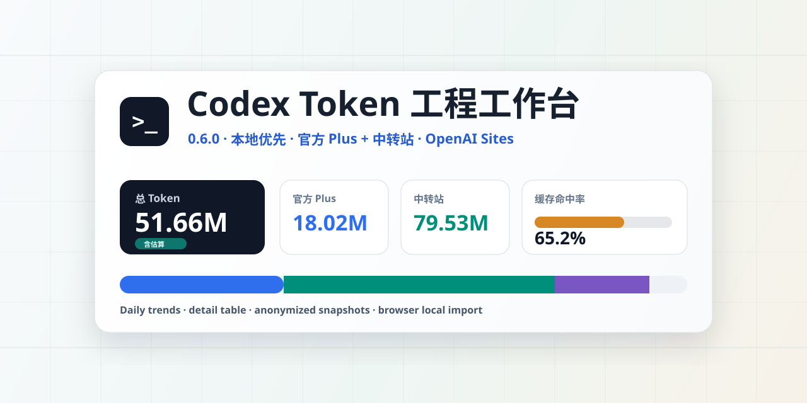
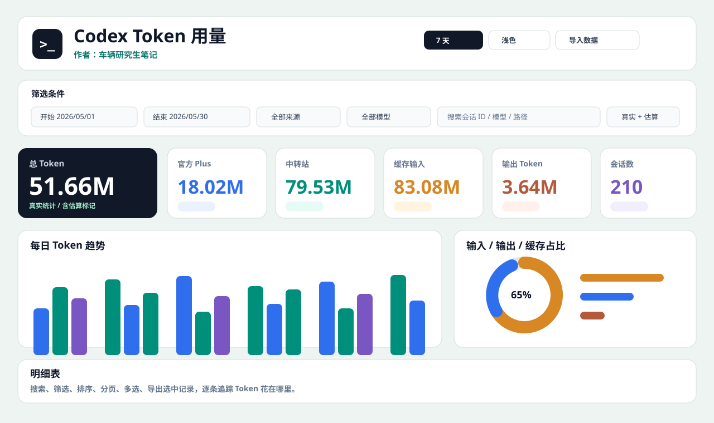

# Codex Token 用量看板

本地优先的 Codex Token 工程级用量工作台。支持官方 Plus、中转站导入、缓存命中率、任务复盘、明细审计和脱敏快照，并可部署到 OpenAI Sites、Netlify 与 GitHub Pages。

> 核心原则：真实数据默认留在你的电脑或浏览器里，不上传。



[](LICENSE)
[](CHANGELOG.md)
[](https://codex-token-dashboard.hazel-saepemx.chatgpt.site)
[](https://codetoken.netlify.app/)
[](https://xiaoqi8553.github.io/codex-token-dashboard/)

## 在线演示

- OpenAI Sites: https://codex-token-dashboard.hazel-saepemx.chatgpt.site
- Netlify Demo: https://codetoken.netlify.app/
- GitHub Pages Demo: https://xiaoqi8553.github.io/codex-token-dashboard/
- GitHub: https://github.com/xiaoqi8553/codex-token-dashboard

OpenAI Sites 生产站与仓库中已经推送的版本保持同步；默认采用仅所有者可访问的私有发布方式。

公开演示站默认加载模拟数据，不会读取访问者电脑。用户可以通过顶部“导入数据”菜单选择自己的 `usage-index.json`、脱敏快照、中转站 CSV/JSON，也可以直接选择整个 `.codex/sessions` 文件夹。所有解析都发生在浏览器本地，解析结果会保存在当前浏览器的 IndexedDB 中，重新打开同一网址时自动恢复。

## 界面预览



## 主要功能

- 自动扫描本地 `.codex/sessions`，支持 JSON / JSONL / log / txt。
- 识别 `usage`、`token_usage`、`last_token_usage`、`total_token_usage` 等 token 字段。
- 支持官方 Plus、中转站、unknown 来源分开统计。
- 缺少精确 usage 时按文本长度估算，并明确标记 `estimated: true`。
- 支持中转站 CSV / JSON 导入。
- 支持总览卡片、今日状态卡、每日趋势、输入/输出/缓存占比、缓存命中率趋势、Top 会话、按模型统计。
- 支持 AI 使用日历，用热力图查看每日 Token、active tokens、输出、缓存命中率和记录数。
- 支持任务复盘，用本地规则识别写代码、调试、前端 UI、文档、部署、数据分析、重构、项目规划等任务类型。
- 今日状态卡支持手动授权定位后查询 Open-Meteo 天气；不会自动读取位置。
- 明细表支持搜索、筛选、排序、分页、多选、选中导出 CSV / JSON。
- 支持脱敏快照 JSON / HTML，适合公开分享。
- 支持本地 Node 模式、浏览器导入模式、Netlify 静态演示版。

## 快速开始

### Windows 双击启动

```bat
start-dashboard.bat
```

默认打开：

```text
http://127.0.0.1:8787
```

如果 `8787` 被占用，会自动尝试 `8788`、`8789`。

### npm 启动

### Windows `.exe` 可行性评估

可行，但当前项目不能简单把 `start-dashboard.bat` 改名为 `.exe`。它现在是“浏览器前端 + 本地 Node 服务”的结构，本地服务会读取 `~/.codex/sessions`、写入 `data/usage-index.json`，精确来源诊断模式还会调用 Python 读取 `logs_2.sqlite`。

面向大众发布 Windows 应用时，推荐先采用 Electron：主进程启动现有本地服务，渲染进程打开 `127.0.0.1` 页面，使用 `electron-builder` 生成安装包。这样可以最大程度复用当前已经验证的导入、刷新和统计逻辑。正式打包前必须完成以下工程化改造：

- 将索引、导入文件和日志迁移到 `%APPDATA%\\Codex Token Dashboard`，避免安装目录不可写。
- 把 Node 服务生命周期交给桌面主进程管理，处理端口占用、退出清理、崩溃提示和升级迁移。
- 将 Python/SQLite 精确诊断改为内置 Node SQLite 能力，或明确把它作为可选诊断组件，避免用户额外安装 Python。
- 增加首次启动向导、sessions 目录选择、数据权限说明、导入进度、失败重试和卸载保留数据选项。
- 对安装包做 Windows Defender、无管理员权限、离线启动、不同用户名路径和大目录导入测试，并为发布包签名。

因此，0.7.2 可以作为稳定的 Web / 本地 Node 版本继续使用；`.exe` 是下一阶段的发布形态，技术上没有阻塞，但需要单独做桌面壳和本地运行时工程，不能只做前端压缩打包。

```bash
npm start
```

常用脚本：

```bash
npm start      # 启动本地看板
npm run dev    # 启动本地看板
npm run scan   # 只扫描并更新 data/usage-index.json
npm run build  # 构建 OpenAI Sites / Netlify / GitHub Pages 发布目录
npm run visual:shot  # 生成 UI 验收截图
npm run visual:test  # 生成截图并自动检查明显视觉问题
```

## 三种使用模式

### 1. 本地 Node 模式

适合自己长期查看真实用量。

```text
.codex/sessions -> server.js -> data/usage-index.json -> /api/usage -> index.html
```

特点：

- 自动读取本机 `~/.codex/sessions`。
- 支持增量扫描，未变化文件会复用旧解析结果。
- 可以导入中转站 CSV / JSON。
- 默认只监听 `127.0.0.1`，不公开到公网。

### 2. 浏览器导入模式

适合不启动 Node 服务，直接在网页里本地解析。

支持导入：

- `.codex/sessions` 文件夹
- `data/usage-index.json`
- 脱敏快照 JSON
- 中转站 CSV / JSON

文件通过浏览器 File API 在本地解析，不会自动上传。

在 Chrome / Edge 等支持 File System Access API 的浏览器里，打开托管站点后，点击顶部“导入数据” -> “选择 sessions 文件夹”，选择你的 `.codex/sessions`。页面会把完整解析结果和文件夹授权句柄保存在浏览器 IndexedDB 中。下次打开同一个网址时会直接恢复上次数据；如果文件夹权限仍有效，点击“刷新”还可以重新扫描最新日志。浏览器仍可能要求再次授予文件夹权限，但这不会影响已缓存数据的显示。

## 页面模块

0.7.2 使用左侧工程工作区导航和容器响应式数据组件，按以下页面组织：

- **运行总览**：核心指标、今日状态、每日 Token 柱状趋势、Token 构成、使用趋势、来源和模型统计。
- **AI 使用日历**：类似 GitHub contribution graph 的热力图，可切换总 Token、active tokens、输出 Token、缓存命中率、记录数。点击日期会自动筛选明细表到当天。
- **任务复盘**：基于本地规则识别任务类型，并统计各类任务消耗。识别结果仅供参考，用户可以在页面里手动修正，修正结果只保存在浏览器 `localStorage`。
- **用量明细**：逐条 usage 记录，支持排序、搜索、筛选、分页、多选和导出。
- **系统设置**：展示当前模式、数据来源、隐私边界、定位、版本和部署方式。

今日状态卡中的定位必须由用户主动点击授权才会读取。授权后，页面会用粗略经纬度请求 OpenStreetMap 反查城市名，并请求 Open-Meteo 获取天气；这些请求只在用户点击授权后发生，不会上传 sessions 或原始对话内容。

## UI 视觉验收

视觉标准和组件防错约束写在 [`docs/UI_ACCEPTANCE.md`](docs/UI_ACCEPTANCE.md)。其中明确要求关键数字不得裁切、同排 KPI 必须对齐、低密度柱图数值不得小于 12px，并同时验证浅色、深色和三种标准宽度。

每次改 UI 后执行：

```bash
npm run ui:shot
npm run ui:audit
npm run ui:report
npm run visual:test
```

### 手动保存 Codex 账号快照

切换账号并完成登录后，在“系统设置”点击“保存当前账号”即可。看板会从当前 Codex 登录信息自动识别邮箱，把 `~/.codex/auth.json` 和 `~/.codex/config.toml` 保存到现有的 `~/.codex/XQ_acc/<当前邮箱>/`，并为同名快照保留覆盖前的备份；识别不到邮箱时自动使用账号 ID。

也可以直接运行项目根目录的 `sync-codex-account.bat`：

```bat
sync-codex-account.bat 工作号
sync-codex-account.bat 工作号 --sync-ccswitch
```

“同步 CC Switch 当前官方配置”是显式勾选项。它只更新 CC Switch 数据库里的 Codex 官方配置，不会切换当前 provider；同步前会在 `~/.cc-switch/backups/` 留下数据库备份。若 CC Switch 正在写数据库，请先退出 CC Switch 再重试。账号快照不会上传到 Sites、GitHub 或 Token Dashboard。

GitHub Pages 版首次使用时运行一次项目目录中的 `install-account-button.bat`。它只在当前 Windows 用户下注册 `codex-token-dashboard://` 专用协议，不需要管理员权限。此后直接在网页点击“保存当前账号”，页面会生成一次性配对密钥和临时端口，自动唤起隐藏的本机组件；保存成功后组件立即关闭，不需要预先启动 BAT 或保持后台服务。

旧的 `start-account-bridge.bat` 继续作为兼容和诊断入口。协议配对信息不会写入浏览器存储，响应也不包含 auth/config、完整路径或 CC Switch 数据库路径；处理器只接受账号快照动作、8 位随机密钥和限定的本机端口。启动失败的诊断会写入 `%TEMP%\codex-account-protocol.log`。

Chrome 或 Edge 首次连接时可能询问是否允许网页访问本地网络，这是浏览器保护本机服务的正常权限提示。只能对 `https://xiaoqi8553.github.io` 允许访问；助手会拒绝其他网页来源。

脚本会启动本地页面，分别截取总览、AI 使用日历、任务复盘、明细表、设置 / 关于页面，并覆盖这些尺寸：

- `1920x1080`
- `1366x768`
- `390x844`

截图保存到：

```text
docs/screenshots/current/
```

这个目录默认被 `.gitignore` 排除，因为截图可能包含本地真实用量数据。

### 3. 托管静态版

适合通过 OpenAI Sites、Netlify 或 GitHub Pages 公开展示和开源体验。

- 只发布 `index.html`、`sample-data/` 和静态资源。
- 没有 Node 扫描能力，不能自动读取访问者电脑。
- 默认加载 `sample-data/demo-usage-index.json`。
- 用户可以手动导入自己的数据。

## 配置

复制配置模板：

```bash
copy config.example.json config.json
```

配置示例：

```json
{
  "sessionsDir": "",
  "port": 8787,
  "host": "127.0.0.1",
  "autoOpenBrowser": false,
  "defaultDateRange": "7d",
  "allowPublicAccess": false,
  "publicAccessToken": "",
  "dashboardPassword": "",
  "anonymizeData": false,
  "sourceAttributionMode": "custom-fast"
}
```

环境变量也可以覆盖配置：

```text
PUBLIC_ACCESS=false
DASHBOARD_PASSWORD=
ACCESS_TOKEN=
ANONYMIZE_DATA=true
HOST=127.0.0.1
PORT=8787
CODEX_SESSIONS_DIR=
SOURCE_ATTRIBUTION_MODE=custom-fast
```

安全规则：

- 默认 `HOST=127.0.0.1`，只允许本机访问。
- 如果 `PUBLIC_ACCESS=true`，必须设置 `DASHBOARD_PASSWORD` 或 `ACCESS_TOKEN`。
- 如果监听公网地址但没有开启公开访问保护，服务会拒绝启动。

## OpenAI Sites 部署

仓库已包含 `.openai/hosting.json` 和 Cloudflare Worker 兼容入口。Codex 的 Sites 功能会执行以下发布链路：

```text
build -> push commit -> 保存 Sites 版本 -> 生产部署
```

生产发布使用已经推送到 Git 的同一 commit，不会部署未同步的本地文件。

## Netlify 部署

1. Fork 或 clone 本仓库。
2. 在 Netlify 导入 GitHub 仓库。
3. Build command:

```bash
npm run build
```

4. Publish directory:

```text
dist
```

`scripts/build-static.js` 只会复制公开安全文件到 `dist/`，不会发布：

- `server.js`
- `data/usage-index.json`
- `data/imports/`
- `config.json`
- `.env`
- 真实 `.codex/sessions`

## 数据字段和统计口径

核心字段：

```text
inputTokens              输入 token
cachedInputTokens        命中缓存的输入 token
uncachedInputTokens      max(inputTokens - cachedInputTokens, 0)
outputTokens             输出 token
totalTokens              优先使用 total_tokens，否则 inputTokens + outputTokens
activeTokens             uncachedInputTokens + outputTokens
cacheHitRate             cachedInputTokens / inputTokens
estimated                是否为估算数据
source                   official_plus / relay / unknown
model                    模型名
sessionId                会话 ID
timestamp                记录时间
taskType                 前端规则识别或示例数据提供的任务类型
```

真实统计来自明确 usage 字段，例如：

```text
input_tokens
cached_input_tokens
output_tokens
total_tokens
last_token_usage
total_token_usage
```

如果没有 usage 字段，会按文本长度估算，并标记：

```json
{
  "estimated": true
}
```

页面会显示“含估算”或“估算”，不会把估算数据伪装成真实统计。

任务复盘的 `taskType` 不参与 token 数值计算，只用于前端分析和分组展示。公开示例数据会提供模拟 `taskType`，真实数据则优先通过本地规则从标题、路径、模型等字段识别；用户手动修正后只保存在当前浏览器。

## 中转站导入字段

CSV / JSON 常见字段会自动兼容：

```text
timestamp / time / date / created_at
session_id / sessionId / conversation_id / request_id / id
model / model_name
input_tokens / prompt_tokens / input
cached_input_tokens / cached_tokens / cached
output_tokens / completion_tokens / output
total_tokens / total / tokens
```

中转站导入的数据统一标记为：

```text
source = relay
```

## 脱敏快照

支持导出：

- `codex-token-snapshot-YYYY-MM-DD.json`
- `codex-token-snapshot-YYYY-MM-DD.html`

快照会隐藏：

- 原始对话内容
- 完整本机路径
- 完整 session id
- `detailText`
- 完整 `sessionTitle`

快照适合公开分享，但不能反推出原始 sessions 内容。

## 项目结构

```text
.
├── index.html                    # 前端页面，包含 UI、图表、导入、导出逻辑
├── server.js                     # 本地 Node 服务，扫描 sessions 并提供 API
├── sites-worker.js               # OpenAI Sites / Cloudflare Worker 静态入口
├── start-dashboard.bat           # Windows 双击启动脚本
├── package.json                  # npm scripts
├── config.example.json           # 配置模板
├── netlify.toml                  # Netlify 部署配置
├── .openai/
│   └── hosting.json              # OpenAI Sites 项目标识与资源声明
├── scripts/
│   ├── build-static.js           # 构建多平台 dist/ 发布目录
│   ├── ui-review.js              # UI 截图、审计与报告
│   ├── visual-check.js           # 交互和响应式视觉冒烟测试
│   └── generate-demo-data.js     # 生成模拟 demo 数据
├── sample-data/
│   ├── demo-usage-index.json     # 公开演示数据
│   └── usage-index.sample.json   # 示例索引
├── data/
│   ├── usage-index.json          # 本地生成的真实索引，已被 .gitignore 排除
│   └── imports/                  # 中转站导入文件，已被 .gitignore 排除
└── screenshots/
    ├── project-cover.svg         # GitHub 项目介绍图
    └── dashboard-preview.svg     # README 预览图
```

## GitHub Topics 建议

建议给仓库添加这些 Topics，方便别人搜索：

```text
codex
token-dashboard
token-usage
openai
openai-sites
ai-tools
usage-analytics
local-first
privacy-first
netlify
javascript
```

GitHub 设置路径：

```text
Repository -> About -> Settings gear -> Topics
```

## GitHub 项目介绍图

仓库介绍图已经放在：

```text
screenshots/project-cover.svg
```

如果要设置 GitHub Social Preview：

```text
Repository -> Settings -> Social preview -> Upload an image
```

README 预览图在：

```text
screenshots/dashboard-preview.svg
```

## 开源安全

`.gitignore` 已排除：

- `data/usage-index.json`
- `data/imports/`
- `config.json`
- `.env`
- `logs/`
- 真实 `.codex/sessions` 日志
- `dist/`
- zip 打包文件

`sample-data/` 只能放模拟数据，不要提交真实 Codex 日志。

## 常见问题

### 托管静态版为什么不能自动读取我的 `.codex/sessions`？

浏览器网页没有权限自动读取你电脑上的任意文件夹。公开版必须由用户手动选择文件，解析也只在浏览器本地发生。

### 公开网址能记住我选择过的 sessions 文件夹吗？

可以。第一次选择文件夹并解析完成后，页面会把解析结果保存在浏览器 IndexedDB 中，下次打开同一个网址会直接恢复，不必再次导入。Chrome / Edge 还会保存文件夹句柄；权限仍有效时可点击“刷新”读取最新日志。如果浏览器拒绝文件夹权限，已缓存的数据仍可查看，只是更新时需要重新授权。

### 官方 Plus Token 一定精确吗？

不一定。Codex 日志中如果有明确 usage 字段，会按真实 usage 统计；如果没有，只能按文本长度估算，并标记为 `estimated: true`。

### 为什么要看 active tokens？

`activeTokens = 未缓存输入 + 输出`。它比总 Token 更能反映“这次真正新增处理了多少内容”，因为 cached input 代表复用上下文。

### 可以公开分享自己的数据吗？

建议只分享脱敏快照，不要分享原始 `sessions` 或本地生成的 `data/usage-index.json`。

## License

MIT
